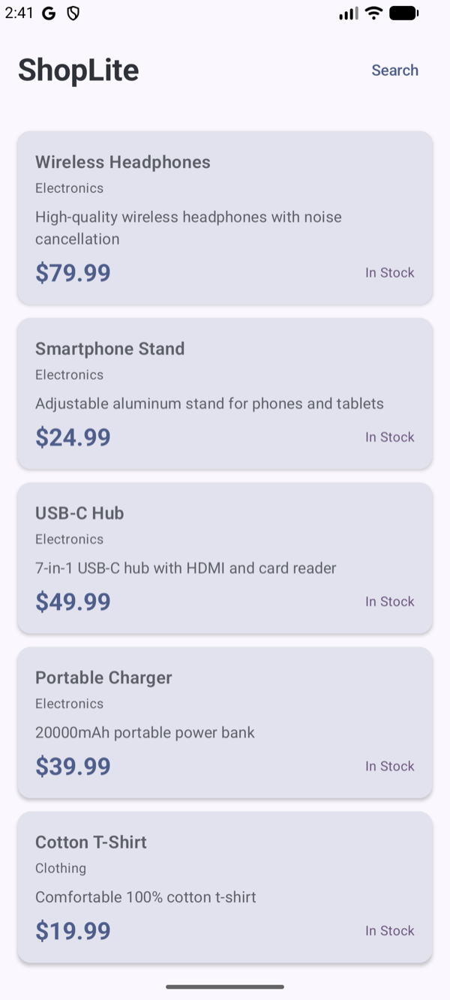
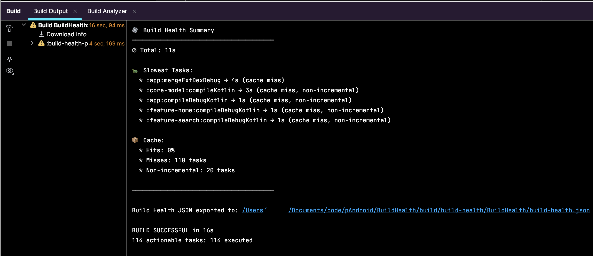
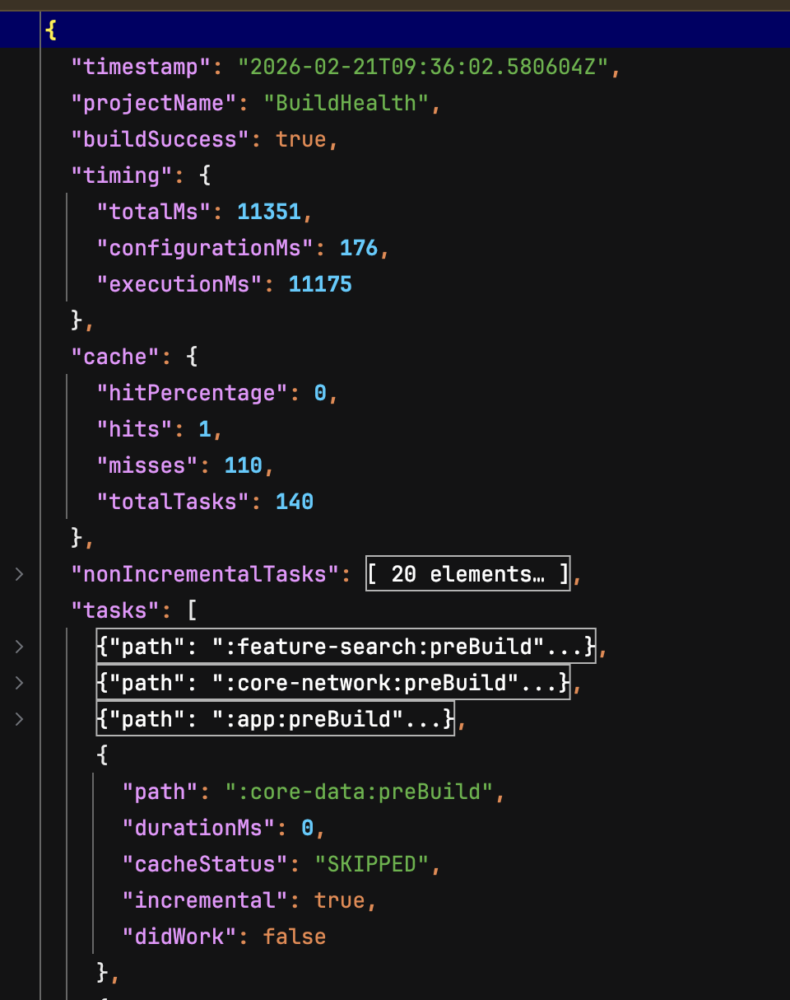

# Build Health

A Gradle plugin that prints a **build-end executive summary** with timing metrics, slowest tasks, and cache statistics. Designed for Android and JVM projects to help developers identify build performance bottlenecks at a glance.

## Requirements

- **Gradle 7.6+** (compatible with Gradle 8.x)
- Java 17+

## Installation

Add the plugin to your root `build.gradle.kts`:

```kotlin
plugins {
    id("com.ebinjoy999.build-health") version "1.0.0"
}
```

Or using the legacy plugin application:

```kotlin
buildscript {
    repositories {
        gradlePluginPortal()
    }
    dependencies {
        classpath("com.ebinjoy999:build-health:1.0.0")
    }
}

apply(plugin = "com.ebinjoy999.build-health")
```

> **Note:** Apply the plugin only to the **root project**. The plugin automatically skips non-root projects to avoid duplicate summaries.

## Usage

Once applied, the plugin automatically prints a build summary after every build:

```
────────────────────────────────────────
⚙️ Build Health Summary
────────────────────────────────────────
⏱ Total: 45.2s

🐢 Slowest Tasks:
  * :app:compileDebugKotlin → 12.3s (cache miss)
  * :core-network:compileDebugKotlin → 8.7s (from cache)
  * :app:mergeDebugResources → 5.1s (up-to-date)
  * :feature-home:compileDebugKotlin → 4.2s (cache miss)
  * :app:packageDebug → 3.8s

📊 Cache: 42% hit rate (18/43 tasks from cache)
────────────────────────────────────────
```

## Screenshots

### Sample Android App


### Build Output



## Configuration

### Enable JSON Export

Export build metrics to a JSON file for CI integration or further analysis.

**Option 1: In build.gradle.kts**

```kotlin
buildHealth {
    exportJson = true
}
```
Output sample



**Option 2: Via command line**

```bash
./gradlew build -PbuildHealth.exportJson=true
```

The JSON file is written to `build/build-health/<project-name>/build-health.json`.

### Configuration Options

| Option | Type | Default | Description |
|--------|------|---------|-------------|
| `exportJson` | `Boolean` | `false` | Enable JSON export of build metrics |
| `slowestTaskCount` | `Int` | `5` | Number of slowest tasks to display |

Example:

```kotlin
buildHealth {
    exportJson = true
    slowestTaskCount = 10
}
```

## CI Integration

For CI environments, enable JSON export via the command line property to avoid modifying build scripts:

```bash
./gradlew build -PbuildHealth.exportJson=true
```

This allows you to capture build metrics without changing the project configuration.

## License

Apache License 2.0
